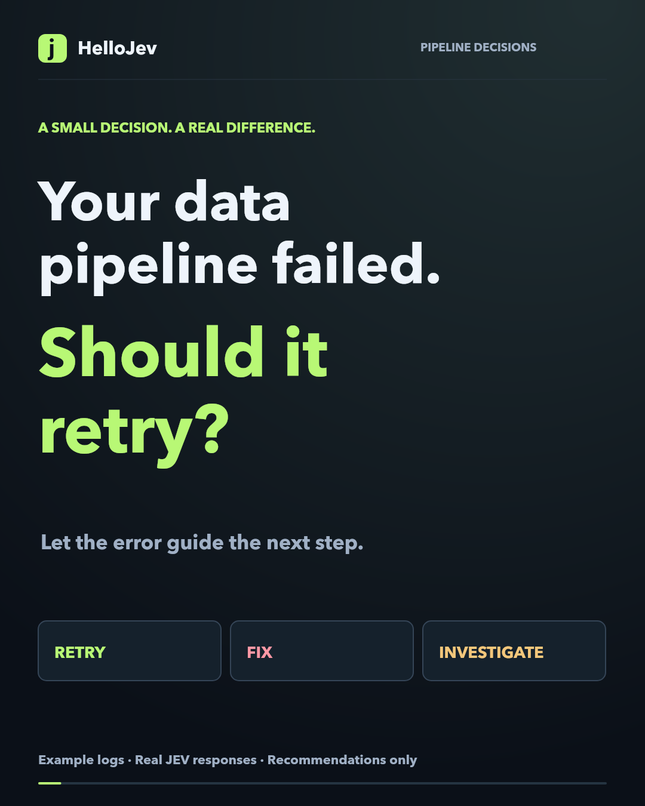
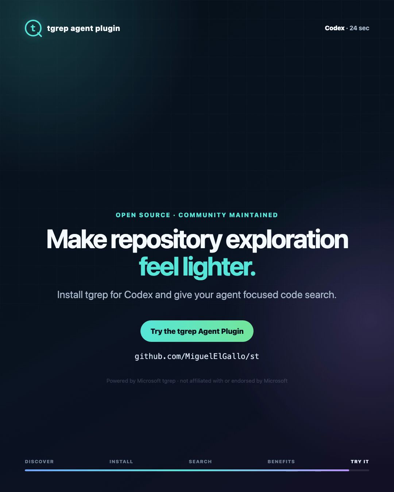
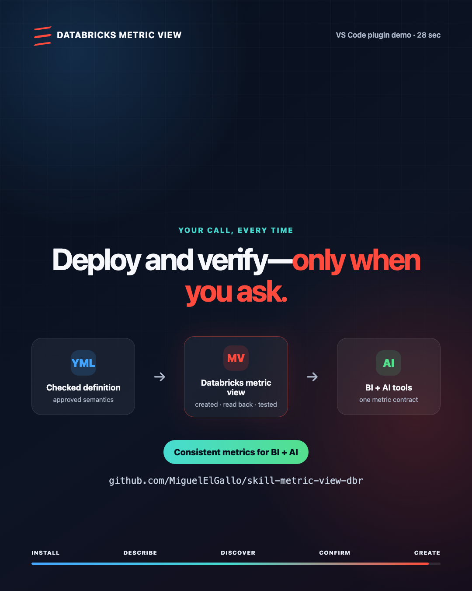
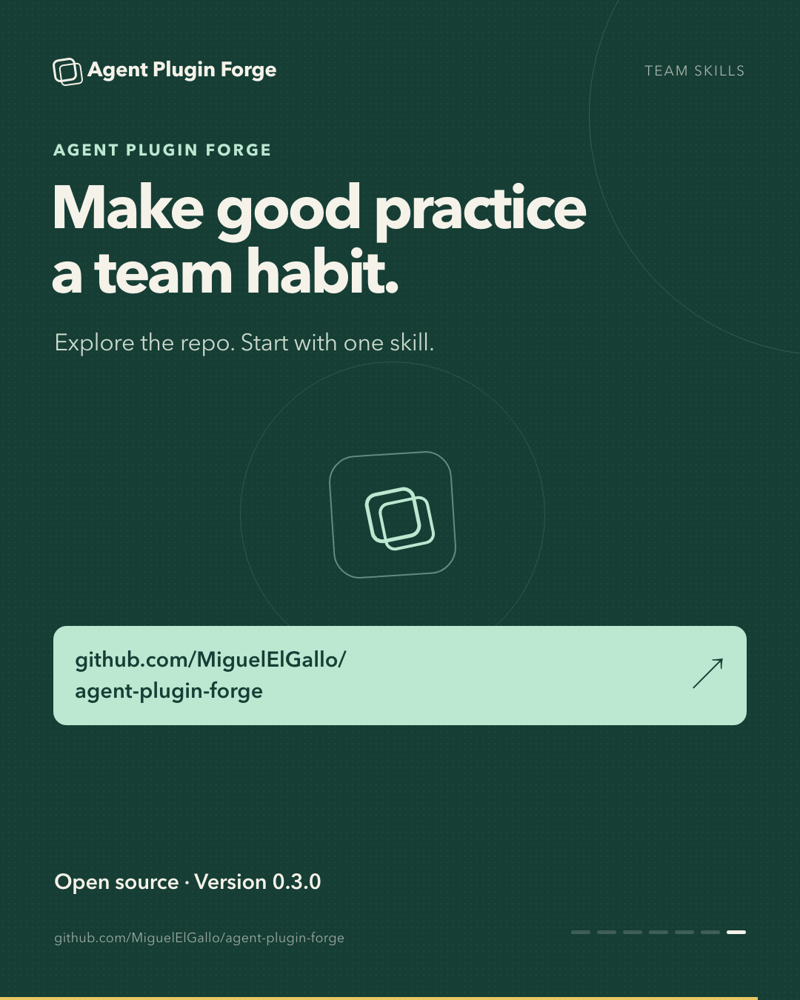
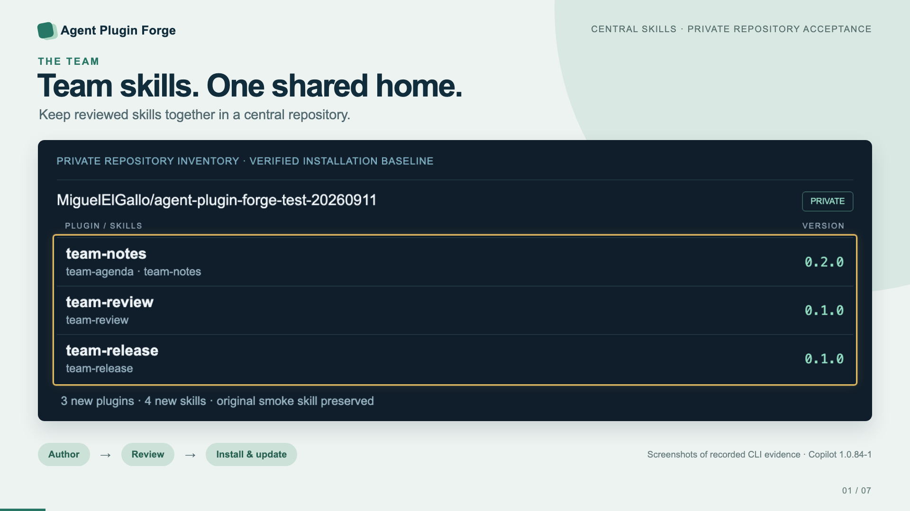

<!-- 8-bit artwork lives in assets/8bit and is generated by update_readme/src/pixel_art.py -->

  <picture>
    <source media="(prefers-color-scheme: dark)" srcset="assets/8bit/banner-dark.svg">
    
  </picture>
    
  
  

## 🐓 Hi, I'm Miguel Peredo Zürcher

<picture>
  <source media="(prefers-color-scheme: dark)" srcset="assets/8bit/player-card-dark.svg">
  
</picture>

🏗️ Seasoned Data Platform Solutions Architect and Principal Data Engineer with 20+ years of experience designing and delivering enterprise data platforms across automotive, banking, and manufacturing sectors in Europe.

☁️ I architect end-to-end solutions on Azure and Snowflake — from data ingestion and data modeling to governance and self-service analytics — while staying hands-on with 🐍 Python, SQL, CI/CD (Azure DevOps & GitHub Actions), and Infrastructure as Code.

🤖 I actively pioneer the use of LLMs and AI Agents (RAG, PydanticAI, Semantic Kernel, MCP) to enhance data engineering workflows and platform intelligence.

🎓 Certified on Azure, Snowflake, Google Cloud, with an MSc in Software & Systems Engineering and executive courses from Stanford and Harvard Business School.

## 🏆 Featured projects

Some of my projects are also available through agent plugin marketplaces and Microsoft's Awesome AZD catalog:

| Project | Where to find it | Quick start |
| :------ | :--------------- | :---------- |
| [iParq](https://github.com/MiguelElGallo/iparq) | [Codex and GitHub Copilot plugin marketplace](https://github.com/MiguelElGallo/iparq#install-as-an-agent-plugin), [VS Code source install](https://github.com/MiguelElGallo/iparq), [PyPI](https://pypi.org/project/iparq/), and [Homebrew](https://github.com/MiguelElGallo/homebrew-iparq) | `codex plugin marketplace add MiguelElGallo/iparq` `codex plugin add iparq@iparq` VS Code: **Chat: Install Plugin From Source** |
| [md-to-pdf](https://github.com/MiguelElGallo/md-to-pdf) | [Codex and GitHub Copilot plugin marketplace](https://github.com/MiguelElGallo/md-to-pdf#install-as-an-agent-plugin), [VS Code source install](https://github.com/MiguelElGallo/md-to-pdf#vs-code), and [GitHub Releases](https://github.com/MiguelElGallo/md-to-pdf/releases/latest) | `codex plugin marketplace add MiguelElGallo/md-to-pdf` `codex plugin add md-to-pdf@md-to-pdf` VS Code: **Chat: Install Plugin From Source** |
| [FastAPI + Snowflake on Azure Functions](https://github.com/MiguelElGallo/simple-fastapi-snow-azd) | [Awesome AZD catalog](https://azure.github.io/awesome-azd/templates/?name=snowflake) | `azd init --template MiguelElGallo/simple-fastapi-snow-azd` |
| [Simple Streamlit on Azure App Service](https://github.com/MiguelElGallo/simple-streamlit-azd) | [Awesome AZD catalog](https://azure.github.io/awesome-azd/templates/?name=streamlit) | `azd init --template MiguelElGallo/simple-streamlit-azd` |
| [FastMCP on Azure App Service](https://github.com/MiguelElGallo/myfirstmcp-openai) | [Awesome AZD catalog](https://azure.github.io/awesome-azd/templates/?name=fastmcp) | `azd init --template MiguelElGallo/myfirstmcp-openai` |

## 📼 LinkedIn video demos

Press ▶ on a cover to watch the video. Each demo links to the repository behind it.

| | |
| :---: | :---: |
|  **HelloJev: smarter pipeline failure decisions** · 42 sec [▶ Watch video](https://miguelelgallo.github.io/MiguelElGallo/assets/linkedin-videos/hellojev.mp4) · [Repository](https://github.com/MiguelElGallo/HelloJev) | |
|  **tgrep for VS Code** · 24 sec [▶ Watch video](https://miguelelgallo.github.io/MiguelElGallo/assets/linkedin-videos/tgrep-vscode.mp4) · [Repository](https://github.com/MiguelElGallo/st) |  **tgrep for Codex** · 24 sec [▶ Watch video](https://miguelelgallo.github.io/MiguelElGallo/assets/linkedin-videos/tgrep-codex.mp4) · [Repository](https://github.com/MiguelElGallo/st) |
|  **docdr** · 28 sec [▶ Watch video](https://miguelelgallo.github.io/MiguelElGallo/assets/linkedin-videos/docdr.mp4) · [Repository](https://github.com/MiguelElGallo/docdr) |  **Databricks Metric View** · 28 sec [▶ Watch video](https://miguelelgallo.github.io/MiguelElGallo/assets/linkedin-videos/databricks-metric-view.mp4) · [Repository](https://github.com/MiguelElGallo/skill-metric-view-dbr) |
|  **Agent Plugin Forge** · 38 sec [▶ Watch video](https://miguelelgallo.github.io/MiguelElGallo/assets/linkedin-videos/agent-plugin-forge.mp4) · [Repository](https://github.com/MiguelElGallo/agent-plugin-forge) |  **Team skills: one shared home** · 60 sec [▶ Watch video](https://miguelelgallo.github.io/MiguelElGallo/assets/linkedin-videos/agent-plugin-forge-team-skills.mp4) · [Repository](https://github.com/MiguelElGallo/agent-plugin-forge) |

<!-- The automated repository table updater preserves everything above the heading below. -->

## 🗺️ All repositories

🤖 This level is regenerated every Sunday by a GitHub Copilot SDK agent.

Here are the repositories I maintain or contribute to:

| Repository | Short Description | Python libraries | Azure services | Data? | AI? |
| :--------- | :---------------- | :--------------- | :------------- | :---: | :-: |
| [mpzsql](https://github.com/MiguelElGallo/mpzsql) ⭐28 | Arrow Flight SQL DuckDB lakehouse | azure-identity, duckdb, grpcio, pyarrow, pyjwt | Blob Storage, Container Apps, PostgreSQL | ✅ | - |
| [iparq](https://github.com/MiguelElGallo/iparq) ⭐25 | Parquet metadata inspection CLI tool | pyarrow, pydantic, rich, typer | - | ✅ | - |
| [modelando](https://github.com/MiguelElGallo/modelando) ⭐11 | Bilingual data modeling educational materials | - | - | ✅ | - |
| [api-elt](https://github.com/MiguelElGallo/api-elt) ⭐9 | ELT pipeline connecting APIs to databases | dlt, python-dotenv | - | ✅ | - |
| [azquack](https://github.com/MiguelElGallo/azquack) ⭐6 | DuckDB Quack protocol on Azure | duckdb | Blob Storage, Container Apps | ✅ | - |
| [snowflake-semantic-view-skill](https://github.com/MiguelElGallo/snowflake-semantic-view-skill) ⭐6 | Snowflake semantic view creation skill | - | - | ✅ | ✅ |
| [FastAPI-in-Snowflake](https://github.com/MiguelElGallo/FastAPI-in-Snowflake) ⭐4 | FastAPI in Snowflake container services | fastapi, passlib, python-jose, snowflake-connector-python, uvicorn | - | ✅ | - |
| [SynapseApacheIceBergExperiment](https://github.com/MiguelElGallo/SynapseApacheIceBergExperiment) ⭐4 | Apache Iceberg on Synapse Spark | - | Synapse Analytics | ✅ | - |
| [evsnow](https://github.com/MiguelElGallo/evsnow) ⭐3 | Event Hubs to Snowflake streaming | azure-eventhub, azure-identity, pydantic-ai, snowflake-connector-python | Event Hubs | ✅ | ✅ |
| [simple-streamlit-azd](https://github.com/MiguelElGallo/simple-streamlit-azd) ⭐3 | Streamlit on Azure App Service | numpy, pandas, streamlit | App Service | ✅ | - |
| [sensormatrix](https://github.com/MiguelElGallo/sensormatrix) ⭐1 | ESP32 sensor testing and regression | pydantic, pyserial, pyyaml, typer | - | ✅ | - |
| [snapshottest](https://github.com/MiguelElGallo/snapshottest) ⭐1 | Inline snapshot testing demonstration | httpx, inline-snapshot, rich, typer | - | - | - |
| [ragsql](https://github.com/MiguelElGallo/ragsql) ⭐1 | RAG-powered SQL query generation | langchain, openai, snowflake-connector-python | - | ✅ | ✅ |
| [HelloJev](https://github.com/MiguelElGallo/HelloJev) | Pipeline failure recommendations with TypeSafe JEV | - | - | ✅ | ✅ |
| [RioArriba](https://github.com/MiguelElGallo/RioArriba) | River shooter arcade game | - | - | - | - |
| [st](https://github.com/MiguelElGallo/st) | Token saver for exploring repositories | - | - | - | - |
| [md-to-pdf](https://github.com/MiguelElGallo/md-to-pdf) | Markdown to PDF with Mermaid support | - | - | - | - |
| [agent-plugin-forge](https://github.com/MiguelElGallo/agent-plugin-forge) | Agent Skills to validated Plugins | jsonschema, license-expression, pydantic, pyyaml, semantic-version | - | - | ✅ |
| [docdr](https://github.com/MiguelElGallo/docdr) | Documentation doctor agent skill | - | - | - | ✅ |
| [bricksgdpr](https://github.com/MiguelElGallo/bricksgdpr) | Databricks dbt GDPR demonstration | dbt-core, dbt-databricks | - | ✅ | - |
| [homebrew-iparq](https://github.com/MiguelElGallo/homebrew-iparq) | Homebrew tap for iparq CLI | - | - | - | - |
| [dbtobsb](https://github.com/MiguelElGallo/dbtobsb) | dbt Core observability for Databricks | - | - | ✅ | - |
| [skill-metric-view-dbr](https://github.com/MiguelElGallo/skill-metric-view-dbr) | Databricks metric view creation skill | - | - | ✅ | ✅ |
| [Modelando2025](https://github.com/MiguelElGallo/Modelando2025) | Data modeling concepts 2025 edition | mkdocs-material, mkdocs-git-committers-plugin, mkdocs-i18n | - | ✅ | - |
| [api-test-pilot](https://github.com/MiguelElGallo/api-test-pilot) | Contract-driven API test generation | httpx, jsonschema, pydantic, pyyaml, typer | - | - | ✅ |
| [azure-ducklake-quack](https://github.com/MiguelElGallo/azure-ducklake-quack) | Azure-native DuckLake with Entra routing | - | Container Apps, PostgreSQL | ✅ | - |
| [evbricks](https://github.com/MiguelElGallo/evbricks) | Event Hubs to Databricks streaming | aiohttp, azure-eventhub, azure-identity, databricks-zerobus-ingest-sdk | Event Hubs | ✅ | - |
| [bricks-cli](https://github.com/MiguelElGallo/bricks-cli) | dbt on Databricks with CLI | - | - | ✅ | - |
| [codemode](https://github.com/MiguelElGallo/codemode) | Code Mode vs MCP comparison | mcp, pydantic | - | - | ✅ |
| [neoquack](https://github.com/MiguelElGallo/neoquack) | DuckDB Quack on free tiers | duckdb, fastapi, httpx, psycopg | - | ✅ | - |
| [SnowflakeCortexCLI](https://github.com/MiguelElGallo/SnowflakeCortexCLI) | Single-role Snowflake Cortex CLI setup | - | - | ✅ | ✅ |
| [snowdag](https://github.com/MiguelElGallo/snowdag) | Airflow dbt in Snowflake containers | - | - | ✅ | - |
| [fastapi-free](https://github.com/MiguelElGallo/fastapi-free) | FastAPI free-threading benchmark | fastapi, prometheus-client, uvicorn | - | - | - |
| [ir-support-site](https://github.com/MiguelElGallo/ir-support-site) | iOS app support site | - | - | - | - |
| [snow_iceberg_snowstorage](https://github.com/MiguelElGallo/snow_iceberg_snowstorage) | Snowflake Iceberg with DuckDB demo | - | - | ✅ | - |
| [snowmcpaz](https://github.com/MiguelElGallo/snowmcpaz) | Snowflake MCP with Azure auth | - | - | ✅ | ✅ |
| [jwtaztoken](https://github.com/MiguelElGallo/jwtaztoken) | Azure JWT token inspector CLI | cryptography, httpx, pyjwt, rich, typer | - | - | - |
| [dlthubarrow](https://github.com/MiguelElGallo/dlthubarrow) | dlt Arrow mode on Azure | azure-monitor-opentelemetry, dlt, psutil, pyarrow, snowflake-connector-python | Container Apps, Key Vault | ✅ | - |
| [snowdcm](https://github.com/MiguelElGallo/snowdcm) | Snowflake DCM objects demonstration | - | - | ✅ | - |
| [dlthubsnow](https://github.com/MiguelElGallo/dlthubsnow) | dlt in Snowflake containers | dlt, requests | - | ✅ | - |
| [Arrow_as_source](https://github.com/MiguelElGallo/Arrow_as_source) | Arrow as universal dataset | arrow, duckdb, polars, pyarrow | - | ✅ | - |
| [ghs](https://github.com/MiguelElGallo/ghs) | Sync env files with GitHub | pydantic, python-dotenv, typer | - | - | - |
| [myfirstmcp-openai](https://github.com/MiguelElGallo/myfirstmcp-openai) | FastMCP on Azure App Service | gunicorn, mcp, uvicorn | App Service | - | ✅ |
| [CallAPIfromLLM](https://github.com/MiguelElGallo/CallAPIfromLLM) | LLM API calling demonstration | - | - | - | ✅ |
| [snowtofu](https://github.com/MiguelElGallo/snowtofu) | Snowflake with OpenTofu IaC | - | Storage Account | ✅ | - |
| [simple-fastapi-snow-azd](https://github.com/MiguelElGallo/simple-fastapi-snow-azd) | FastAPI Snowflake on Azure Functions | fastapi, snowflake-sqlalchemy | Functions | ✅ | - |
| [embeddindataengineering](https://github.com/MiguelElGallo/embeddindataengineering) | OpenAI embeddings in Fabric | - | - | ✅ | ✅ |
| [mycv](https://github.com/MiguelElGallo/mycv) | Personal CV repository | - | - | - | - |
| [dltHub-teesting](https://github.com/MiguelElGallo/dltHub-teesting) | dltHub pytest testing | dlt, duckdb, mypy, pytest | - | ✅ | - |
| [ChartToMD](https://github.com/MiguelElGallo/ChartToMD) | Chart to markdown for RAG | aiohttp, azure-identity, pydantic, typer | - | - | ✅ |
| [SnowCLI](https://github.com/MiguelElGallo/SnowCLI) | Snowflake CLI with GitHub Actions | - | - | ✅ | - |
| [rag-graph](https://github.com/MiguelElGallo/rag-graph) | Graph approaches for RAG testing | - | - | - | ✅ |
| [opeanai-rag-test](https://github.com/MiguelElGallo/opeanai-rag-test) | OpenAI RAG Spanish document testing | openai, python-dotenv | - | - | ✅ |
| [ragvectordb](https://github.com/MiguelElGallo/ragvectordb) | Embeddings in multiple vector databases | - | AI Search | ✅ | ✅ |
| [azdcodespaces](https://github.com/MiguelElGallo/azdcodespaces) | AZD in Codespaces configuration | - | - | - | - |
| [azureaisearch](https://github.com/MiguelElGallo/azureaisearch) | Azure AI Search embeddings demo | - | AI Search | - | ✅ |
| [azopenai_adx](https://github.com/MiguelElGallo/azopenai_adx) | Azure Data Explorer embeddings storage | - | Data Explorer | ✅ | ✅ |
| [semker](https://github.com/MiguelElGallo/semker) | Semantic Kernel Python examples | semantic-kernel | - | - | ✅ |
| [dvsat](https://github.com/MiguelElGallo/dvsat) | Data Vault extended satellite demo | - | - | ✅ | - |
| [JoinOrAssociation](https://github.com/MiguelElGallo/JoinOrAssociation) | BI tool fan trap handling | - | - | ✅ | - |

_💾 Last saved: 2026-09-20_
