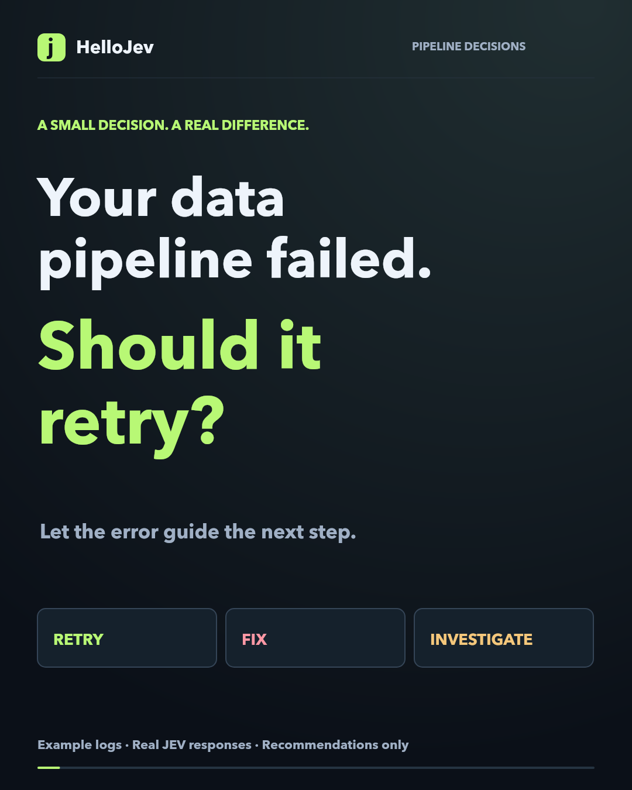
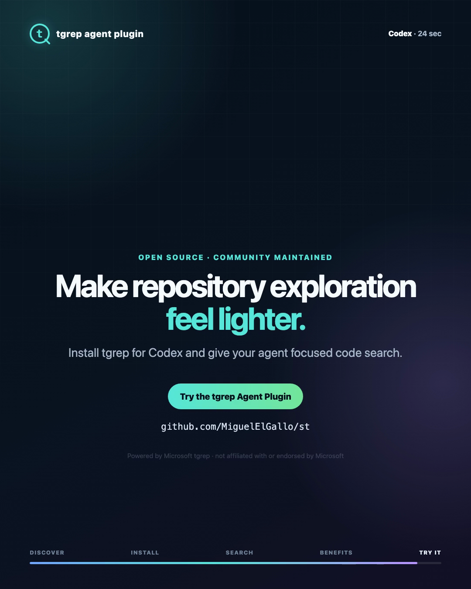
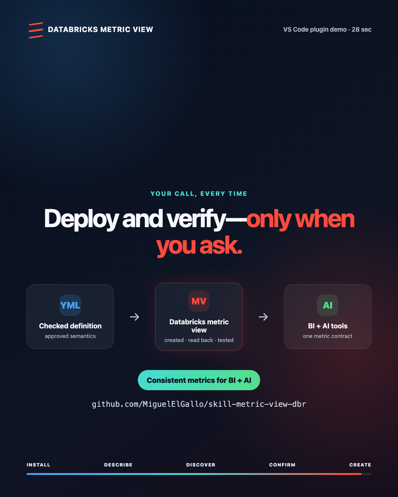
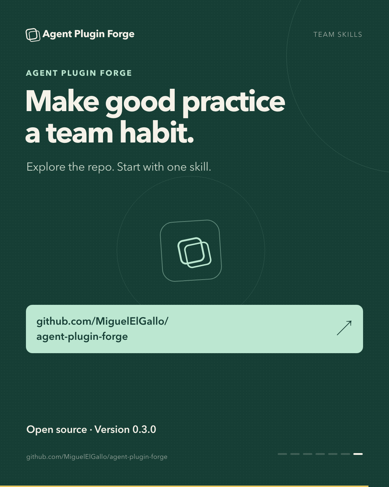
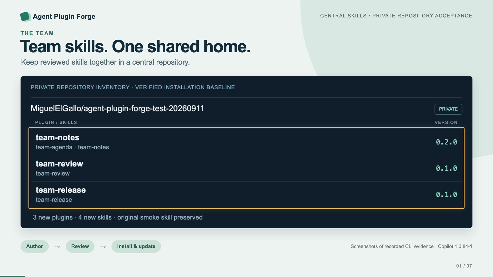

<!-- 8-bit artwork lives in assets/8bit and is generated by update_readme/src/pixel_art.py -->

  <picture>
    <source media="(prefers-color-scheme: dark)" srcset="assets/8bit/banner-dark.svg">
    
  </picture>
    
  
  

## 🐓 Hi, I'm Miguel Peredo Zürcher

<picture>
  <source media="(prefers-color-scheme: dark)" srcset="assets/8bit/player-card-dark.svg">
  
</picture>

🏗️ Seasoned Data Platform Solutions Architect and Principal Data Engineer with 20+ years of experience designing and delivering enterprise data platforms across automotive, banking, and manufacturing sectors in Europe.

☁️ I architect end-to-end solutions on Azure and Snowflake — from data ingestion and data modeling to governance and self-service analytics — while staying hands-on with 🐍 Python, SQL, CI/CD (Azure DevOps & GitHub Actions), and Infrastructure as Code.

🤖 I actively pioneer the use of LLMs and AI Agents (RAG, PydanticAI, Semantic Kernel, MCP) to enhance data engineering workflows and platform intelligence.

🎓 Certified on Azure, Snowflake, Google Cloud, with an MSc in Software & Systems Engineering and executive courses from Stanford and Harvard Business School.

## 🏆 Featured projects

Some of my projects are also available through agent plugin marketplaces and Microsoft's Awesome AZD catalog:

<table>
  <tr>
    <td width="50%" valign="top">
      <h3>🧩 <a href="https://github.com/MiguelElGallo/iparq">iParq</a></h3>
      
Inspect Parquet metadata from your terminal or your coding agent.

      
   

      <pre>codex plugin marketplace add MiguelElGallo/iparq
codex plugin add iparq@iparq</pre>
      VS Code: <b>Chat: Install Plugin From Source</b>
    </td>
    <td width="50%" valign="top">
      <h3>📄 <a href="https://github.com/MiguelElGallo/md-to-pdf">md-to-pdf</a></h3>
      
Turn Markdown (with Mermaid diagrams) into polished PDFs.

      
  

      <pre>codex plugin marketplace add MiguelElGallo/md-to-pdf
codex plugin add md-to-pdf@md-to-pdf</pre>
      VS Code: <b>Chat: Install Plugin From Source</b>
    </td>
  </tr>
</table>

<table>
  <tr>
    <td width="33%" valign="top">
      <b>⚡ <a href="https://github.com/MiguelElGallo/simple-fastapi-snow-azd">FastAPI + Snowflake on Azure Functions</a></b>
      

      <code>azd init --template MiguelElGallo/simple-fastapi-snow-azd</code>
    </td>
    <td width="33%" valign="top">
      <b>📈 <a href="https://github.com/MiguelElGallo/simple-streamlit-azd">Simple Streamlit on Azure App Service</a></b>
      

      <code>azd init --template MiguelElGallo/simple-streamlit-azd</code>
    </td>
    <td width="33%" valign="top">
      <b>🤖 <a href="https://github.com/MiguelElGallo/myfirstmcp-openai">FastMCP on Azure App Service</a></b>
      

      <code>azd init --template MiguelElGallo/myfirstmcp-openai</code>
    </td>
  </tr>
</table>

## 📼 LinkedIn video demos

Press ▶ on a cover to watch the video. Each demo links to the repository behind it.

<table>
  <tr>
    <td colspan="2" align="center" valign="top">
       
      <b>🆕 HelloJev: smarter pipeline failure decisions</b> 
      ⏱ 42 sec · <a href="https://miguelelgallo.github.io/MiguelElGallo/assets/linkedin-videos/hellojev.mp4">▶ Watch video</a> · <a href="https://github.com/MiguelElGallo/HelloJev">📦 Repository</a>
    </td>
  </tr>
  <tr>
    <td width="50%" align="center" valign="top">
       
      <b>tgrep for VS Code</b> 
      ⏱ 24 sec · <a href="https://miguelelgallo.github.io/MiguelElGallo/assets/linkedin-videos/tgrep-vscode.mp4">▶ Watch video</a> · <a href="https://github.com/MiguelElGallo/st">📦 Repository</a>
    </td>
    <td width="50%" align="center" valign="top">
       
      <b>tgrep for Codex</b> 
      ⏱ 24 sec · <a href="https://miguelelgallo.github.io/MiguelElGallo/assets/linkedin-videos/tgrep-codex.mp4">▶ Watch video</a> · <a href="https://github.com/MiguelElGallo/st">📦 Repository</a>
    </td>
  </tr>
  <tr>
    <td width="50%" align="center" valign="top">
       
      <b>docdr</b> 
      ⏱ 28 sec · <a href="https://miguelelgallo.github.io/MiguelElGallo/assets/linkedin-videos/docdr.mp4">▶ Watch video</a> · <a href="https://github.com/MiguelElGallo/docdr">📦 Repository</a>
    </td>
    <td width="50%" align="center" valign="top">
       
      <b>Databricks Metric View</b> 
      ⏱ 28 sec · <a href="https://miguelelgallo.github.io/MiguelElGallo/assets/linkedin-videos/databricks-metric-view.mp4">▶ Watch video</a> · <a href="https://github.com/MiguelElGallo/skill-metric-view-dbr">📦 Repository</a>
    </td>
  </tr>
  <tr>
    <td width="50%" align="center" valign="top">
       
      <b>Agent Plugin Forge</b> 
      ⏱ 38 sec · <a href="https://miguelelgallo.github.io/MiguelElGallo/assets/linkedin-videos/agent-plugin-forge.mp4">▶ Watch video</a> · <a href="https://github.com/MiguelElGallo/agent-plugin-forge">📦 Repository</a>
    </td>
    <td width="50%" align="center" valign="top">
       
      <b>Team skills: one shared home</b> 
      ⏱ 60 sec · <a href="https://miguelelgallo.github.io/MiguelElGallo/assets/linkedin-videos/agent-plugin-forge-team-skills.mp4">▶ Watch video</a> · <a href="https://github.com/MiguelElGallo/agent-plugin-forge">📦 Repository</a>
    </td>
  </tr>
</table>

<!-- The automated repository table updater preserves everything above the heading below. -->

## 🗺️ All repositories

🤖 This level is regenerated every Sunday by a GitHub Copilot SDK agent.

Here are the repositories I maintain or contribute to:
🕹️ High-score table · sorted by stars, then latest push · 📊 data · 🤖 AI

| # | Repository | ⭐ | What it does | 🐍 Python libraries | ☁️ Azure services | Tags |
| :-: | :-- | :-: | :-- | :-- | :-- | :-: |
| 🥇 | **[mpzsql](https://github.com/MiguelElGallo/mpzsql)** | 28 | Arrow Flight SQL DuckDB lakehouse | `azure-identity` `duckdb` `grpcio` `pyarrow` `pyjwt` | Blob Storage, Container Apps, PostgreSQL | 📊 |
| 🥈 | **[iparq](https://github.com/MiguelElGallo/iparq)** | 25 | Parquet metadata inspection CLI | `pyarrow` `pydantic` `rich` `typer` | - | 📊 |
| 🥉 | **[modelando](https://github.com/MiguelElGallo/modelando)** | 11 | Bilingual data modeling materials | - | - | 📊 |
| 04 | **[api-elt](https://github.com/MiguelElGallo/api-elt)** | 9 | ELT pipeline for APIs | `dlt` `python-dotenv` | - | 📊 |
| 05 | **[azquack](https://github.com/MiguelElGallo/azquack)** | 6 | DuckDB Quack protocol Azure | `duckdb` | Blob Storage, Container Apps | 📊 |
| 06 | **[snowflake-semantic-view-skill](https://github.com/MiguelElGallo/snowflake-semantic-view-skill)** | 6 | Snowflake semantic view skill | - | - | 📊 🤖 |
| 07 | **[FastAPI-in-Snowflake](https://github.com/MiguelElGallo/FastAPI-in-Snowflake)** | 4 | FastAPI in Snowflake containers | `fastapi` `passlib` `python-jose` `snowflake-connector-python` `uvicorn` | - | 📊 |
| 08 | **[SynapseApacheIceBergExperiment](https://github.com/MiguelElGallo/SynapseApacheIceBergExperiment)** | 4 | Apache Iceberg on Synapse Spark | - | Synapse Analytics | 📊 |
| 09 | **[evsnow](https://github.com/MiguelElGallo/evsnow)** | 3 | Event Hubs to Snowflake streaming | `azure-eventhub` `azure-identity` `pydantic-ai` `snowflake-connector-python` | Event Hubs | 📊 🤖 |
| 10 | **[simple-streamlit-azd](https://github.com/MiguelElGallo/simple-streamlit-azd)** | 3 | Streamlit on Azure App Service | `numpy` `pandas` `streamlit` | App Service | 📊 |
| 11 | **[sensormatrix](https://github.com/MiguelElGallo/sensormatrix)** | 1 | ESP32 sensor testing framework | `pydantic` `pyserial` `pyyaml` `typer` | - | 📊 |
| 12 | **[snapshottest](https://github.com/MiguelElGallo/snapshottest)** | 1 | Inline snapshot testing demo | `httpx` `inline-snapshot` `rich` `typer` | - | - |
| 13 | **[ragsql](https://github.com/MiguelElGallo/ragsql)** | 1 | RAG-powered SQL queries | `langchain` `openai` `snowflake-connector-python` | - | 📊 🤖 |
| 14 | **[md-to-pdf](https://github.com/MiguelElGallo/md-to-pdf)** | - | Markdown to PDF converter | - | - | - |
| 15 | **[agent-plugin-forge](https://github.com/MiguelElGallo/agent-plugin-forge)** | - | Agent Skills to Plugins | `jsonschema` `license-expression` `pydantic` `pyyaml` `semantic-version` | - | 🤖 |
| 16 | **[HelloJev](https://github.com/MiguelElGallo/HelloJev)** | - | Pipeline failure decisions AI | - | - | 📊 🤖 |
| 17 | **[RioArriba](https://github.com/MiguelElGallo/RioArriba)** | - | River shooter arcade game | - | - | - |
| 18 | **[st](https://github.com/MiguelElGallo/st)** | - | Token saver for repositories | - | - | - |
| 19 | **[docdr](https://github.com/MiguelElGallo/docdr)** | - | Documentation doctor skill | - | - | 🤖 |
| 20 | **[bricksgdpr](https://github.com/MiguelElGallo/bricksgdpr)** | - | Databricks dbt GDPR demo | `dbt-core` `dbt-databricks` | - | 📊 |
| 21 | **[homebrew-iparq](https://github.com/MiguelElGallo/homebrew-iparq)** | - | Homebrew iparq tap | - | - | - |
| 22 | **[dbtobsb](https://github.com/MiguelElGallo/dbtobsb)** | - | dbt Core Databricks observability | - | - | 📊 |
| 23 | **[skill-metric-view-dbr](https://github.com/MiguelElGallo/skill-metric-view-dbr)** | - | Databricks metric view skill | - | - | 📊 🤖 |
| 24 | **[Modelando2025](https://github.com/MiguelElGallo/Modelando2025)** | - | Data modeling 2025 materials | `mkdocs-material` `mkdocs-git-committers-plugin` `mkdocs-i18n` | - | 📊 |
| 25 | **[api-test-pilot](https://github.com/MiguelElGallo/api-test-pilot)** | - | Contract-driven API testing | `httpx` `jsonschema` `pydantic` `pyyaml` `typer` | - | 🤖 |
| 26 | **[azure-ducklake-quack](https://github.com/MiguelElGallo/azure-ducklake-quack)** | - | Azure DuckLake Entra routing | - | Container Apps, PostgreSQL | 📊 |
| 27 | **[evbricks](https://github.com/MiguelElGallo/evbricks)** | - | Event Hubs Databricks streaming | `aiohttp` `azure-eventhub` `azure-identity` `databricks-zerobus-ingest-sdk` | Event Hubs | 📊 |
| 28 | **[bricks-cli](https://github.com/MiguelElGallo/bricks-cli)** | - | dbt on Databricks CLI | - | - | 📊 |
| 29 | **[codemode](https://github.com/MiguelElGallo/codemode)** | - | Code Mode vs MCP comparison | `mcp` `pydantic` | - | 🤖 |
| 30 | **[neoquack](https://github.com/MiguelElGallo/neoquack)** | - | DuckDB Quack free tiers | `duckdb` `fastapi` `httpx` `psycopg` | - | 📊 |
| 31 | **[SnowflakeCortexCLI](https://github.com/MiguelElGallo/SnowflakeCortexCLI)** | - | Snowflake Cortex CLI security | - | - | 📊 🤖 |
| 32 | **[snowdag](https://github.com/MiguelElGallo/snowdag)** | - | Airflow dbt Snowflake containers | - | - | 📊 |
| 33 | **[fastapi-free](https://github.com/MiguelElGallo/fastapi-free)** | - | FastAPI free-threading benchmark | `fastapi` `prometheus-client` `uvicorn` | - | - |
| 34 | **[ir-support-site](https://github.com/MiguelElGallo/ir-support-site)** | - | iOS app support pages | - | - | - |
| 35 | **[snow_iceberg_snowstorage](https://github.com/MiguelElGallo/snow_iceberg_snowstorage)** | - | Snowflake Iceberg DuckDB | - | - | 📊 |
| 36 | **[snowmcpaz](https://github.com/MiguelElGallo/snowmcpaz)** | - | Snowflake MCP Azure auth | - | - | 📊 🤖 |
| 37 | **[jwtaztoken](https://github.com/MiguelElGallo/jwtaztoken)** | - | Azure JWT token inspector | `cryptography` `httpx` `pyjwt` `rich` `typer` | - | - |
| 38 | **[dlthubarrow](https://github.com/MiguelElGallo/dlthubarrow)** | - | dlt Arrow on Azure | `azure-monitor-opentelemetry` `dlt` `psutil` `pyarrow` `snowflake-connector-python` | Container Apps, Key Vault | 📊 |
| 39 | **[snowdcm](https://github.com/MiguelElGallo/snowdcm)** | - | Snowflake DCM objects | - | - | 📊 |
| 40 | **[dlthubsnow](https://github.com/MiguelElGallo/dlthubsnow)** | - | dlt in Snowflake | `dlt` `requests` | - | 📊 |
| 41 | **[Arrow_as_source](https://github.com/MiguelElGallo/Arrow_as_source)** | - | Arrow universal dataset | `arrow` `duckdb` `polars` `pyarrow` | - | 📊 |
| 42 | **[ghs](https://github.com/MiguelElGallo/ghs)** | - | Sync env with GitHub | `pydantic` `python-dotenv` `typer` | - | - |
| 43 | **[myfirstmcp-openai](https://github.com/MiguelElGallo/myfirstmcp-openai)** | - | FastMCP Azure App Service | `gunicorn` `mcp` `uvicorn` | App Service | 🤖 |
| 44 | **[CallAPIfromLLM](https://github.com/MiguelElGallo/CallAPIfromLLM)** | - | LLM API calling demo | - | - | 🤖 |
| 45 | **[snowtofu](https://github.com/MiguelElGallo/snowtofu)** | - | Snowflake OpenTofu IaC | - | Storage Account | 📊 |
| 46 | **[simple-fastapi-snow-azd](https://github.com/MiguelElGallo/simple-fastapi-snow-azd)** | - | FastAPI Snowflake Functions | `fastapi` `snowflake-sqlalchemy` | Functions | 📊 |
| 47 | **[embeddindataengineering](https://github.com/MiguelElGallo/embeddindataengineering)** | - | OpenAI embeddings Fabric | - | - | 📊 🤖 |
| 48 | **[mycv](https://github.com/MiguelElGallo/mycv)** | - | Personal CV repository | - | - | - |
| 49 | **[dltHub-teesting](https://github.com/MiguelElGallo/dltHub-teesting)** | - | dltHub pytest testing | `dlt` `duckdb` `mypy` `pytest` | - | 📊 |
| 50 | **[ChartToMD](https://github.com/MiguelElGallo/ChartToMD)** | - | Chart to markdown RAG | `aiohttp` `azure-identity` `pydantic` `typer` | - | 🤖 |
| 51 | **[SnowCLI](https://github.com/MiguelElGallo/SnowCLI)** | - | Snowflake CLI GitHub Actions | - | - | 📊 |
| 52 | **[rag-graph](https://github.com/MiguelElGallo/rag-graph)** | - | Graph RAG approaches | - | - | 🤖 |
| 53 | **[opeanai-rag-test](https://github.com/MiguelElGallo/opeanai-rag-test)** | - | OpenAI RAG Spanish | `openai` `python-dotenv` | - | 🤖 |
| 54 | **[ragvectordb](https://github.com/MiguelElGallo/ragvectordb)** | - | Multiple vector databases | - | AI Search | 📊 🤖 |
| 55 | **[azdcodespaces](https://github.com/MiguelElGallo/azdcodespaces)** | - | AZD in Codespaces | - | - | - |
| 56 | **[azureaisearch](https://github.com/MiguelElGallo/azureaisearch)** | - | Azure AI Search embeddings | - | AI Search | 🤖 |
| 57 | **[azopenai_adx](https://github.com/MiguelElGallo/azopenai_adx)** | - | Data Explorer embeddings | - | Data Explorer | 📊 🤖 |
| 58 | **[semker](https://github.com/MiguelElGallo/semker)** | - | Semantic Kernel examples | `semantic-kernel` | - | 🤖 |
| 59 | **[dvsat](https://github.com/MiguelElGallo/dvsat)** | - | Data Vault satellite demo | - | - | 📊 |
| 60 | **[JoinOrAssociation](https://github.com/MiguelElGallo/JoinOrAssociation)** | - | BI tool fan trap handling | - | - | 📊 |

_💾 Last saved: 2026-09-27_
